# Scheduler AI - Manajemen Tujuan & Jadwal Cerdas

## 🎯 Gambaran Umum

**Scheduler AI** adalah aplikasi produktivitas cerdas yang mengubah tujuan Anda menjadi jadwal terstruktur dan dapat ditindaklanjuti menggunakan kecerdasan buatan. Aplikasi ini membantu pengguna memecah tujuan ambisius menjadi kegiatan harian yang dapat dikelola, secara otomatis menghasilkan jadwal optimal sambil mempertimbangkan preferensi pribadi, komitmen yang ada, dan batasan waktu yang realistis.

## 🌟 Mengapa Kami Membangun Aplikasi Ini

### Masalah Saat Ini:
- **Kelumpuhan Tujuan**: Orang kesulitan mengubah tujuan besar menjadi langkah-langkah yang dapat ditindaklanjuti
- **Manajemen Waktu Buruk**: Kesulitan dalam alokasi waktu yang realistis untuk pencapaian tujuan
- **Konflik Jadwal**: Penjadwalan manual sering menyebabkan komitmen yang tumpang tindih
- **Kurangnya Struktur**: Tujuan tetap abstrak tanpa rencana implementasi konkret
- **Kemajuan Tidak Konsisten**: Tanpa struktur harian, tujuan sering diabaikan

### Dampak di Dunia Nyata:
Studi menunjukkan bahwa hanya **8% orang** yang mencapai resolusi Tahun Baru mereka, dan **92% gagal** karena kurangnya perencanaan terstruktur dan penjadwalan yang realistis. Aplikasi produktivitas tradisional berfokus pada manajemen tugas tetapi gagal menjembatani kesenjangan antara tujuan aspirasional dan eksekusi harian.

## 🚀 Tujuan Aplikasi Ini

### Objektif Utama:
1. **Dekomposisi Tujuan Cerdas**: Mengubah tujuan abstrak menjadi kegiatan konkret yang terikat waktu
2. **Penjadwalan Bertenaga AI**: Menghasilkan jadwal harian realistis yang sesuai dengan gaya hidup pengguna
3. **Perencanaan Bebas Konflik**: Secara otomatis menghindari konflik jadwal dengan komitmen yang ada
4. **Visualisasi Kemajuan**: Memberikan visibilitas yang jelas terhadap kemajuan pencapaian tujuan
5. **Pembelajaran Adaptif**: Belajar dari perilaku pengguna untuk meningkatkan rekomendasi masa depan

### Objektif Sekunder:
- Mengurangi kelelahan pengambilan keputusan dalam perencanaan harian
- Meningkatkan tingkat penyelesaian tujuan melalui pendekatan terstruktur
- Memberikan wawasan berbasis data tentang pola produktivitas
- Menciptakan kebiasaan berkelanjutan melalui penjadwalan yang konsisten

## 💡 Manfaat Utama

### Untuk Pengguna Individual:
- **🎯 Tingkat Keberhasilan Lebih Tinggi**: Pendekatan terstruktur meningkatkan penyelesaian tujuan hingga 300%
- **⏰ Optimisasi Waktu**: Penjadwalan AI memaksimalkan jam produktif
- **🧠 Beban Mental Berkurang**: Perencanaan otomatis menghilangkan kelelahan pengambilan keputusan
- **📈 Pelacakan Kemajuan**: Pemantauan kemajuan visual mempertahankan motivasi
- **🔄 Pembentukan Kebiasaan**: Penjadwalan konsisten membangun rutinitas berkelanjutan

### Untuk Tim & Organisasi:
- **👥 Tujuan Terkoordinasi**: Menyelaraskan jadwal individu dengan objektif tim
- **📊 Analitik Kinerja**: Melacak metrik produktivitas di seluruh tim
- **🎨 Optimisasi Sumber Daya**: Alokasi waktu dan sumber daya manusia yang efisien
- **📋 Akuntabilitas**: Visibilitas yang jelas terhadap kemajuan tujuan dan komitmen

### Untuk Institusi Pendidikan:
- **📚 Perencanaan Studi**: Memecah kurikulum menjadi sesi harian yang dapat dikelola
- **🎓 Persiapan Ujian**: Jadwal studi yang dihasilkan AI untuk retensi optimal
- **⚖️ Keseimbangan Hidup-Kerja**: Menyeimbangkan tujuan akademik dengan kegiatan pribadi

## 🛠️ Stack Teknologi

### Frontend:
- **Next.js 15** - Framework React dengan App Router
- **TypeScript** - Pengembangan type-safe
- **Tailwind CSS** - Framework CSS utility-first
- **Shadcn/ui** - Library komponen UI modern
- **React Hook Form** - Manajemen state form
- **Date-fns** - Utilitas manipulasi tanggal

### Backend:
- **Next.js API Routes** - Backend serverless
- **Prisma ORM** - Pemodelan dan query database
- **PostgreSQL** - Database utama (via Supabase)
- **NextAuth.js** - Manajemen autentikasi

### AI & Kecerdasan:
- **Anthropic Claude** - Pemrosesan bahasa alami dan analisis tujuan
- **Custom AI Prompts** - Prompt khusus untuk generasi jadwal
- **Smart Parsing** - Ekstraksi cerdas tanggal, tujuan, dan preferensi

### Infrastruktur:
- **Supabase** - Hosting database dan storage
- **Vercel** - Deployment dan hosting aplikasi
- **GitHub Actions** - Pipeline CI/CD
- **ESLint + Prettier** - Kualitas kode dan formatting

### Tools Pengembangan:
- **Claude Code** - Pengembangan dengan bantuan AI
- **TypeScript Strict Mode** - Type checking yang ditingkatkan
- **React DevTools** - Debugging komponen
- **Prisma Studio** - Manajemen database

## 🏗️ Gambaran Arsitektur

### Arsitektur Sistem


### Arsitektur Alur Data


## 📱 Fitur Utama

### 🤖 Pemrosesan Tujuan Bertenaga AI
- Input tujuan bahasa alami ("Belajar Python dalam 3 bulan")
- Ekstraksi dan validasi tanggal cerdas
- Dekomposisi tujuan otomatis menjadi kegiatan harian
- Sistem saran cerdas berdasarkan riwayat pengguna

### 📅 Penjadwalan Cerdas
- Generasi jadwal bebas konflik
- Menghormati preferensi pengguna (tidur, jam kerja)
- Alokasi waktu adaptif berdasarkan kompleksitas tujuan
- Integrasi dengan sistem kalender yang ada

### 📊 Manajemen Kemajuan
- Pelacakan kemajuan real-time
- Indikator penyelesaian visual
- Update status jadwal (None, In Progress, Completed, Missed)
- Analitik dan wawasan tujuan

### 🎨 Pengalaman Pengguna Modern
- Desain responsif untuk semua perangkat
- Pembuatan tujuan langkah demi langkah yang intuitif
- Tampilan kalender interaktif
- Update real-time tanpa refresh halaman

### 🔐 Aman & Terpercaya
- Autentikasi OAuth (GitHub, Google)
- Penyimpanan data terenkripsi
- Praktik privasi yang sesuai GDPR
- Error handling dan fallback yang robust

## 🎯 Kasus Penggunaan Target

### Pengembangan Pribadi:
- **Pembelajaran Skill**: "Belajar web development dalam 6 bulan"
- **Tujuan Fitness**: "Lari marathon dalam 1 tahun"
- **Proyek Kreatif**: "Menulis novel dalam 90 hari"
- **Perencanaan Keuangan**: "Menabung Rp 150 juta dalam 12 bulan"

### Pertumbuhan Profesional:
- **Kemajuan Karir**: "Dipromosikan menjadi senior developer"
- **Persiapan Sertifikasi**: "Lulus ujian sertifikasi AWS"
- **Membangun Jaringan**: "Menghadiri 2 acara industri per bulan"
- **Peningkatan Skill**: "Menguasai React dan TypeScript"

### Kesuksesan Akademik:
- **Persiapan Ujian**: "Persiapan ujian akhir"
- **Proyek Penelitian**: "Menyelesaikan tesis dalam 6 bulan"
- **Pembelajaran Bahasa**: "Mencapai kemahiran B2 dalam bahasa Inggris"
- **Kebiasaan Belajar**: "Membangun rutinitas belajar yang konsisten"

### Manajemen Hidup:
- **Kesehatan & Wellness**: "Mengembangkan praktik meditasi"
- **Tujuan Hubungan**: "Menghabiskan waktu berkualitas dengan keluarga"
- **Pengembangan Hobi**: "Belajar gitar dan memainkan 10 lagu"
- **Perencanaan Perjalanan**: "Mengunjungi 5 negara tahun ini"

## 🚀 Memulai

### Prasyarat:
- Node.js 18+ 
- npm/yarn/pnpm
- Database PostgreSQL (atau akun Supabase)
- Kunci API Anthropic

### Instalasi:

1. **Clone repository**
   ```bash
   git clone https://github.com/your-username/scheduler-ai.git
   cd scheduler-ai
   ```

2. **Install dependencies**
   ```bash
   npm install
   # atau
   yarn install
   ```

3. **Setup environment variables**
   ```bash
   cp .env.example .env
   ```
   
   Konfigurasi variabel berikut:
   ```env
   # Database
   DATABASE_URL="your-postgresql-url"
   DIRECT_URL="your-postgresql-direct-url"
   
   # Authentication
   AUTH_SECRET="your-auth-secret"
   AUTH_GITHUB_ID="your-github-oauth-id"
   AUTH_GITHUB_SECRET="your-github-oauth-secret"
   AUTH_GOOGLE_ID="your-google-oauth-id"
   AUTH_GOOGLE_SECRET="your-google-oauth-secret"
   
   # AI
   ANTHROPIC_API_KEY="your-anthropic-api-key"
   
   # Supabase
   NEXT_PUBLIC_SUPABASE_URL="your-supabase-url"
   NEXT_PUBLIC_SUPABASE_ANON_KEY="your-supabase-anon-key"
   SUPABASE_SERVICE_ROLE_KEY="your-supabase-service-role-key"
   ```

4. **Setup database**
   ```bash
   npx prisma migrate dev
   npx prisma generate
   ```

5. **Jalankan development server**
   ```bash
   npm run dev
   ```

6. **Buka aplikasi**
   Navigasi ke [http://localhost:3000](http://localhost:3000)

## 🔄 Diagram Alur Pengguna

### Alur Pembuatan Tujuan


### Alur Manajemen Jadwal

```mermaid
stateDiagram-v2
    [*] --> None: Jadwal Dibuat
    None --> InProgress: Pengguna Mulai Tugas
    None --> Missed: Waktu Terlewat
    InProgress --> Completed: Tugas Selesai
    InProgress --> Missed: Waktu Habis
    Missed --> InProgress: Pengguna Melanjutkan
    Completed --> [*]: Tugas Selesai
    
    None: 📅 Belum Dimulai
    InProgress: ⏳ Sedang Berlangsung  
    Completed: ✅ Selesai
    Missed: ❌ Terlewat
```


### Skema Database


## 📁 Struktur Proyek

```
scheduler-ai/
├── app/                          # Next.js App Router
│   ├── (logged-in)/             # Route yang dilindungi
│   │   ├── (app-layout)/        # Layout aplikasi utama
│   │   │   ├── ai/              # Pembuatan tujuan AI
│   │   │   ├── calendar/        # Tampilan kalender
│   │   │   ├── dashboard/       # Dashboard utama
│   │   │   ├── goals/           # Manajemen tujuan
│   │   │   └── settings/        # Pengaturan pengguna
│   │   └── onboarding/          # Onboarding pengguna
│   ├── api/                     # API routes
│   │   ├── ai-chat/            # Endpoint percakapan AI
│   │   ├── auth/               # Autentikasi
│   │   ├── dashboard/          # Data dashboard
│   │   ├── goals/              # Operasi CRUD tujuan
│   │   └── schedules/          # Manajemen jadwal
│   ├── components/             # Komponen React
│   │   ├── calendar/           # Komponen kalender
│   │   ├── goals/              # Komponen terkait tujuan
│   │   ├── scheduler/          # Flow pembuatan jadwal
│   │   ├── settings/           # Komponen pengaturan
│   │   └── ui/                 # Komponen UI dasar
│   ├── hooks/                  # Custom React hooks
│   ├── lib/                    # Fungsi utilitas
│   └── globals.css             # Style global
├── components/                  # Komponen bersama
├── prisma/                     # Schema database
├── public/                     # Asset statis
└── docs/                       # Dokumentasi
```

## 🤝 Berkontribusi

Kami menyambut kontribusi! Silakan lihat [Panduan Kontribusi](CONTRIBUTING.md) untuk detail.

### Workflow Pengembangan:
1. Fork repository
2. Buat feature branch
3. Buat perubahan Anda
4. Tambahkan test jika diperlukan
5. Jalankan test suite
6. Submit pull request

### Standar Kode:
- Ikuti best practices TypeScript
- Gunakan Prettier untuk formatting kode
- Tulis commit message yang bermakna
- Tambahkan komentar JSDoc untuk fungsi kompleks

## 🤖 Pipeline Pemrosesan AI

### Alur Pemrosesan Tujuan AI
```mermaid
graph TD
    A[Input Pengguna: "Belajar Python dalam 3 bulan"] --> B[Analisis Input]
    B --> C{Deteksi Tipe Input}
    
    C -->|Pemilihan Saran| D[Ekstrak Judul & Deskripsi Saja]
    C -->|Input Manual| E[Analisis Konteks Lengkap]
    
    E --> F[Ekstraksi Tanggal]
    F --> G{Tanggal Ditemukan?}
    G -->|Ya| H[Parse & Validasi Tanggal]
    G -->|Tidak| I[Minta Input Tanggal]
    
    D --> J[Generate Deskripsi]
    H --> K[Cek Kelengkapan Data]
    I --> K
    J --> K
    
    K --> L{Semua Field Lengkap?}
    L -->|Tidak| M[Return Data Parsial]
    L -->|Ya| N[Generate Rencana Jadwal]
    
    N --> O[Deteksi Konflik]
    O --> P[Cek Preferensi Pengguna]
    P --> Q[Optimisasi Waktu]
    Q --> R[Generate Jadwal Harian]
    R --> S[Return Tujuan Lengkap]
    
    style A fill:#e3f2fd
    style C fill:#fff3e0
    style N fill:#fff3e0
    style R fill:#fff3e0
    style S fill:#c8e6c9
```

### Alur Optimisasi Performa


## 📊 Performa & Optimisasi

### Optimisasi yang Dicapai:
- **Loading time 50-60% lebih cepat** melalui konsolidasi API
- **Zero infinite render loops** dengan calendar hooks yang stabil
- **Update real-time** tanpa refresh halaman
- **Re-rendering yang dioptimalkan** dengan memoization React

### Fitur Performa:
- Server-side rendering untuk initial load yang lebih cepat
- Optimisasi gambar dengan Next.js
- Query database yang efisien dengan Prisma
- Strategi caching untuk response API

## 🔒 Keamanan & Privasi

### Langkah-langkah Keamanan:
- **Autentikasi OAuth** dengan provider terpercaya
- **Enkripsi Data** dalam transit dan saat istirahat
- **Validasi Input** dan sanitasi
- **Rate Limiting** pada endpoint API
- **Perlindungan CSRF** dengan NextAuth.js

### Komitmen Privasi:
- **Minimisasi Data**: Hanya mengumpulkan informasi yang diperlukan
- **Kontrol Pengguna**: Pengguna dapat menghapus data mereka kapan saja
- **Kebijakan Transparan**: Kebijakan privasi dan syarat layanan yang jelas
- **Kepatuhan GDPR**: Menghormati hak privasi pengguna

## 🐛 Masalah yang Diketahui & Roadmap

### Keterbatasan Saat Ini:
- Aplikasi mobile belum tersedia (desain web responsif)
- Integrasi terbatas dengan layanan kalender eksternal
- Dashboard analitik dasar (fitur lanjutan direncanakan)

### Fitur Mendatang:
- 📱 Pengembangan aplikasi mobile (React Native)
- 🔗 Integrasi Google Calendar / Outlook
- 📈 Analitik dan wawasan lanjutan
- 👥 Fitur kolaborasi tim
- 🌍 Dukungan multi-bahasa
- 🎨 Tema kustom dan personalisasi

## 📞 Dukungan & Kontak

### Dapatkan Bantuan:
- **Dokumentasi**: [docs.scheduler-ai.com](https://docs.scheduler-ai.com)
- **Issues**: [GitHub Issues](https://github.com/your-username/scheduler-ai/issues)
- **Diskusi**: [GitHub Discussions](https://github.com/your-username/scheduler-ai/discussions)
- **Email**: support@scheduler-ai.com

### Komunitas:
- **Discord**: [Bergabung dengan komunitas kami](https://discord.gg/scheduler-ai)
- **Twitter**: [@SchedulerAI](https://twitter.com/SchedulerAI)
- **LinkedIn**: [Scheduler AI](https://linkedin.com/company/scheduler-ai)

## 📄 Lisensi

Proyek ini dilisensikan di bawah MIT License - lihat file [LICENSE](LICENSE) untuk detail.

## 🙏 Penghargaan

- **Anthropic** untuk menyediakan Claude AI API
- **Vercel** untuk platform hosting dan deployment
- **Supabase** untuk layanan database dan autentikasi
- **Shadcn/ui** untuk library komponen yang indah
- **Tim Next.js** untuk framework yang luar biasa
- **Komunitas open source** untuk tools dan library

---

**Dibangun dengan ❤️ oleh Tim Scheduler AI**

*Mengubah tujuan menjadi kenyataan, satu jadwal dalam satu waktu.*

---

## 🇮🇩 Catatan Khusus Indonesia

### Konteks Lokal:
Aplikasi ini sangat relevan untuk konteks Indonesia di mana:
- **Budaya Kerja**: Membantu professionals Indonesia mengoptimalkan waktu kerja
- **Pendidikan**: Mendukung siswa dan mahasiswa dalam manajemen studi
- **Entrepreneurship**: Membantu startup dan UMKM dalam perencanaan bisnis
- **Work-Life Balance**: Membantu generasi milenial Indonesia mencapai keseimbangan hidup

### Adaptasi Budaya:
- **Bahasa Indonesia**: Interface yang sepenuhnya mendukung Bahasa Indonesia
- **Zona Waktu**: Optimisasi untuk WIB, WITA, dan WIT
- **Hari Libur**: Integrasi dengan kalender hari libur nasional Indonesia
- **Jam Kerja**: Penyesuaian dengan pola kerja khas Indonesia

### Peluang Pasar:
Indonesia memiliki **270+ juta penduduk** dengan penetrasi smartphone **89%** dan internet **73%**, menjadikan pasar yang sangat potensial untuk aplikasi produktivitas berbasis AI seperti Scheduler AI.

*Mari bersama-sama meningkatkan produktivitas Indonesia! 🇮🇩*