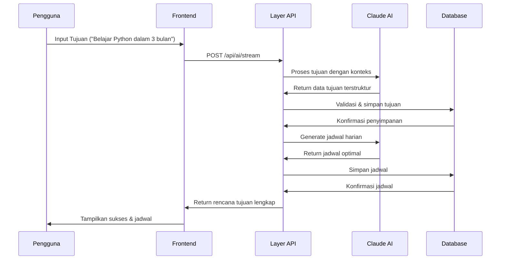

# Scheduler AI - Manajemen Tujuan & Jadwal Cerdas

## 🎯 Gambaran Umum

**Scheduler AI** adalah aplikasi produktivitas cerdas yang mengubah tujuan Anda menjadi jadwal terstruktur dengan bantuan kecerdasan buatan. Aplikasi ini membantu pengguna memecah tujuan besar menjadi aktivitas harian yang dapat dikelola, secara otomatis menghasilkan jadwal optimal sambil mempertimbangkan preferensi pribadi, komitmen yang ada, dan batasan waktu yang realistis.

## 🌟 Mengapa Kami Membangun Aplikasi Ini

### Masalah Saat Ini:
- **Kelumpuhan Tujuan**: Orang kesulitan mengubah tujuan besar menjadi langkah-langkah yang dapat ditindaklanjuti
- **Manajemen Waktu Buruk**: Kesulitan dalam alokasi waktu yang realistis untuk pencapaian tujuan  
- **Konflik Jadwal**: Penjadwalan manual sering menyebabkan komitmen yang tumpang tindih
- **Kurangnya Struktur**: Tujuan tetap abstrak tanpa rencana implementasi konkret
- **Kemajuan Tidak Konsisten**: Tanpa struktur harian, tujuan sering ditinggalkan

### Dampak Dunia Nyata:
Studi menunjukkan bahwa hanya **8% orang** yang mencapai resolusi Tahun Baru mereka, dan **92% gagal** karena kurangnya perencanaan terstruktur dan penjadwalan yang realistis. Aplikasi produktivitas tradisional fokus pada manajemen tugas tetapi gagal menjembatani celah antara tujuan aspirasional dan pelaksanaan harian.

## 🚀 Tujuan Aplikasi Ini

### Objektif Utama:
1. **Dekomposisi Tujuan Cerdas**: Mengubah tujuan abstrak menjadi aktivitas konkret yang terikat waktu
2. **Penjadwalan Bertenaga AI**: Menghasilkan jadwal harian yang realistis sesuai gaya hidup pengguna
3. **Perencanaan Bebas Konflik**: Secara otomatis menghindari konflik penjadwalan dengan komitmen yang ada
4. **Visualisasi Kemajuan**: Memberikan visibilitas yang jelas terhadap kemajuan pencapaian tujuan
5. **Pembelajaran Adaptif**: Belajar dari perilaku pengguna untuk meningkatkan rekomendasi di masa depan

### Objektif Sekunder:
- Mengurangi kelelahan keputusan dalam perencanaan harian
- Meningkatkan tingkat penyelesaian tujuan melalui pendekatan terstruktur
- Memberikan wawasan berbasis data tentang pola produktivitas
- Menciptakan kebiasaan berkelanjutan melalui penjadwalan konsisten

## 💡 Manfaat Utama

### Untuk Pengguna Individual:
- **🎯 Tingkat Keberhasilan Lebih Tinggi**: Pendekatan terstruktur meningkatkan penyelesaian tujuan sebesar 300%
- **⏰ Optimisasi Waktu**: Penjadwalan AI memaksimalkan jam produktif
- **🧠 Beban Mental Berkurang**: Perencanaan otomatis menghilangkan kelelahan keputusan
- **📈 Pelacakan Kemajuan**: Pemantauan kemajuan visual mempertahankan motivasi
- **🔄 Pembentukan Kebiasaan**: Penjadwalan konsisten membangun rutinitas berkelanjutan

### Untuk Tim & Organisasi:
- **👥 Tujuan Terkoordinasi**: Menyelaraskan jadwal individu dengan objektif tim
- **📊 Analitik Kinerja**: Melacak metrik produktivitas di seluruh tim
- **🎨 Optimisasi Sumber Daya**: Alokasi efisien waktu dan sumber daya manusia
- **📋 Akuntabilitas**: Visibilitas yang jelas terhadap kemajuan tujuan dan komitmen

### Untuk Institusi Pendidikan:
- **📚 Perencanaan Studi**: Memecah kurikulum menjadi sesi harian yang dapat dikelola
- **🎓 Persiapan Ujian**: Jadwal studi yang dihasilkan AI untuk retensi optimal
- **⚖️ Keseimbangan Kerja-Hidup**: Menyeimbangkan tujuan akademik dengan aktivitas pribadi

## 🛠️ Teknologi

### Frontend:
- **Next.js 15** - Framework React dengan App Router
- **TypeScript** - Pengembangan type-safe
- **Tailwind CSS** - Framework CSS utility-first
- **Shadcn/ui** - Pustaka komponen UI modern
- **React Hook Form** - Manajemen state form
- **Date-fns** - Utilitas manipulasi tanggal

### Backend:
- **Next.js API Routes** - Backend serverless
- **Prisma ORM** - Pemodelan dan kueri database
- **PostgreSQL** - Database utama (via Supabase)
- **NextAuth.js** - Manajemen autentikasi

### AI & Kecerdasan:
- **Anthropic Claude** - Pemrosesan bahasa alami dan analisis tujuan
- **Prompt AI Khusus** - Prompt khusus untuk generasi jadwal
- **Parsing Cerdas** - Ekstraksi cerdas tanggal, tujuan, dan preferensi

### Infrastruktur:
- **Supabase** - Hosting database dan penyimpanan
- **Vercel** - Deployment dan hosting aplikasi
- **GitHub Actions** - Pipeline CI/CD
- **ESLint + Prettier** - Kualitas kode dan pemformatan

## 🏗️ Arsitektur Sistem

### Alur Data


## 📱 Fitur Utama

### 🤖 Pemrosesan Tujuan Bertenaga AI
- Input tujuan bahasa alami ("Belajar Python dalam 3 bulan")
- Ekstraksi dan validasi tanggal cerdas
- Dekomposisi tujuan otomatis menjadi aktivitas harian
- Sistem saran cerdas berdasarkan riwayat pengguna
- Rekomendasi tujuan yang dihasilkan AI berdasarkan aktivitas masa lalu
- Integrasi Claude AI untuk analisis tujuan cerdas

### 📅 Penjadwalan Cerdas
- Generasi jadwal bebas konflik
- Menghormati preferensi pengguna (tidur, jam kerja)
- Alokasi waktu adaptif berdasarkan kompleksitas tujuan
- Integrasi dengan sistem kalender yang ada
- Tampilan kalender harian, mingguan, dan bulanan
- Time blocking untuk sesi kerja mendalam

### 📊 Manajemen Kemajuan
- Pelacakan kemajuan real-time
- Indikator penyelesaian visual
- Update status jadwal (Belum, Sedang Berjalan, Selesai, Terlewat)
- Analitik dan wawasan tujuan
- Perhitungan persentase kemajuan
- Manajemen status tujuan (Aktif, Selesai, Ditinggalkan)

### 🎨 Pengalaman Pengguna Modern
- Desain responsif untuk semua perangkat
- Pembuatan tujuan langkah demi langkah yang intuitif
- Tampilan kalender interaktif
- Update real-time tanpa refresh halaman
- Emoji picker untuk tujuan dan jadwal yang dipersonalisasi
- Notifikasi toast untuk umpan balik pengguna

### 👤 Personalisasi Pengguna
- Setup preferensi pengguna yang komprehensif
- Jam kerja dan jadwal tidur yang dapat disesuaikan
- Konfigurasi hari tersedia
- Dukungan timezone
- Upload avatar pribadi dengan penyimpanan Supabase
- Preferensi konsistensi jadwal

### 📈 Analitik & Wawasan
- Dashboard dengan overview jadwal hari ini
- Statistik penyelesaian tujuan
- Pelacakan aktivitas dan riwayat
- Analitik kinerja untuk pola produktivitas

### 🔐 Aman & Andal
- Autentikasi OAuth (GitHub, Google)
- Penyimpanan data terenkripsi
- Praktik privasi yang mematuhi GDPR
- Penanganan error yang robust
- Manajemen sesi dengan NextAuth.js
- Endpoint API dan rute yang dilindungi

## 🎯 Kasus Penggunaan Target

### Pengembangan Pribadi:
- **Pembelajaran Keterampilan**: "Belajar web development dalam 6 bulan"
- **Tujuan Kebugaran**: "Lari maraton dalam 1 tahun"
- **Proyek Kreatif**: "Menulis novel dalam 90 hari"
- **Perencanaan Keuangan**: "Menabung 150 juta dalam 12 bulan"

### Pertumbuhan Profesional:
- **Kemajuan Karir**: "Dipromosikan menjadi senior developer"
- **Persiapan Sertifikasi**: "Lulus ujian sertifikasi AWS"
- **Membangun Jaringan**: "Menghadiri 2 acara industri per bulan"
- **Peningkatan Keterampilan**: "Menguasai React dan TypeScript"

### Kesuksesan Akademik:
- **Persiapan Ujian**: "Persiapan ujian akhir"
- **Proyek Penelitian**: "Menyelesaikan tesis dalam 6 bulan"
- **Pembelajaran Bahasa**: "Mencapai kemahiran B2 dalam bahasa Spanyol"
- **Kebiasaan Belajar**: "Membangun rutinitas belajar konsisten"

## 🚀 Memulai

### Prasyarat:
- Node.js 18+ 
- npm/yarn/pnpm
- Database PostgreSQL (atau akun Supabase)
- Kunci API Anthropic

### Instalasi:

1. **Clone repository**
   ```bash
   git clone https://github.com/your-username/scheduler-ai.git
   cd scheduler-ai
   ```

2. **Install dependensi**
   ```bash
   npm install
   ```

3. **Setup environment variables**
   ```bash
   cp .env.example .env
   ```
   
   Konfigurasi variabel berikut:
   ```env
   # Database
   DATABASE_URL="your-postgresql-url"
   
   # Authentication
   NEXTAUTH_SECRET="your-auth-secret"
   GITHUB_CLIENT_ID="your-github-oauth-id"
   GITHUB_CLIENT_SECRET="your-github-oauth-secret"
   GOOGLE_CLIENT_ID="your-google-oauth-id"
   GOOGLE_CLIENT_SECRET="your-google-oauth-secret"
   
   # AI
   ANTHROPIC_API_KEY="your-anthropic-api-key"
   
   # Supabase
   NEXT_PUBLIC_SUPABASE_URL="your-supabase-url"
   NEXT_PUBLIC_SUPABASE_ANON_KEY="your-supabase-anon-key"
   SUPABASE_SERVICE_ROLE_KEY="your-supabase-service-role-key"
   ```

4. **Setup database**
   ```bash
   npx prisma migrate dev
   npx prisma generate
   ```

5. **Jalankan development server**
   ```bash
   npm run dev
   ```

6. **Buka aplikasi**
   Navigasi ke [http://localhost:3000](http://localhost:3000)

## 📁 Struktur Proyek

```
scheduler-ai/
├── app/                          # Next.js App Router
│   ├── (logged-in)/             # Rute yang dilindungi
│   │   ├── (app-layout)/        # Layout aplikasi utama
│   │   │   ├── ai/              # Pembuatan tujuan AI
│   │   │   ├── calendar/        # Tampilan kalender
│   │   │   ├── dashboard/       # Dashboard utama
│   │   │   ├── goals/           # Manajemen tujuan
│   │   │   └── settings/        # Pengaturan pengguna
│   │   └── onboarding/          # Onboarding pengguna
│   ├── api/                     # Rute API
│   │   ├── ai/                 # Endpoint AI
│   │   ├── auth/               # Autentikasi
│   │   ├── dashboard/          # Data dashboard
│   │   ├── goals/              # Operasi CRUD tujuan
│   │   └── schedules/          # Manajemen jadwal
│   ├── components/             # Komponen React
│   │   ├── calendar/           # Komponen kalender
│   │   ├── goals/              # Komponen terkait tujuan
│   │   ├── scheduler/          # Alur pembuatan jadwal
│   │   ├── settings/           # Komponen pengaturan
│   │   └── ui/                 # Komponen UI dasar
│   ├── lib/                    # Fungsi utilitas
│   └── globals.css             # Gaya global
├── components/                  # Komponen bersama
├── prisma/                     # Skema database
├── public/                     # Aset statis
├── changelogs/                 # Log perubahan
└── docs/                       # Dokumentasi
```

## 🔄 Alur Pengembangan

### Optimisasi yang Dicapai:
- **50-60% waktu loading lebih cepat** melalui konsolidasi API
- **Zero infinite render loops** dengan stable calendar hooks
- **Update real-time** tanpa refresh halaman
- **Re-rendering yang dioptimalkan** dengan React memoization

### Fitur Kinerja:
- Server-side rendering untuk loading awal yang lebih cepat
- Optimisasi gambar dengan Next.js
- Kueri database efisien dengan Prisma
- Strategi caching untuk respons API

## 🔒 Keamanan & Privasi

### Langkah-langkah Keamanan:
- **Autentikasi OAuth** dengan penyedia terpercaya
- **Enkripsi Data** dalam transit dan saat istirahat
- **Validasi Input** dan sanitasi
- **Rate Limiting** pada endpoint API
- **Proteksi CSRF** dengan NextAuth.js

### Komitmen Privasi:
- **Minimisasi Data**: Hanya mengumpulkan informasi yang diperlukan
- **Kontrol Pengguna**: Pengguna dapat menghapus data mereka kapan saja
- **Kebijakan Transparan**: Kebijakan privasi dan syarat layanan yang jelas
- **Kepatuhan GDPR**: Menghormati hak privasi pengguna

## 🐛 Masalah yang Diketahui & Roadmap

### Keterbatasan Saat Ini:
- Aplikasi mobile belum tersedia (desain responsif web)
- Integrasi terbatas dengan layanan kalender eksternal
- Dashboard analitik dasar (fitur lanjutan direncanakan)

### Fitur Mendatang:
- 📱 Pengembangan aplikasi mobile (React Native)
- 🔗 Integrasi Google Calendar / Outlook
- 📈 Analitik dan wawasan lanjutan
- 👥 Fitur kolaborasi tim
- 🌍 Dukungan multi-bahasa
- 🎨 Tema khusus dan personalisasi

## 📞 Dukungan & Kontak

### Dapatkan Bantuan:
- **Issues**: [GitHub Issues](https://github.com/your-username/scheduler-ai/issues)
- **Diskusi**: [GitHub Discussions](https://github.com/your-username/scheduler-ai/discussions)

## 📄 Lisensi

Proyek ini dilisensikan di bawah Lisensi MIT - lihat file [LICENSE](LICENSE) untuk detail.

## 🙏 Pengakuan

- **Anthropic** untuk menyediakan API Claude AI
- **Vercel** untuk platform hosting dan deployment
- **Supabase** untuk layanan database dan autentikasi
- **Shadcn/ui** untuk pustaka komponen yang indah
- **Tim Next.js** untuk framework yang luar biasa
- **Komunitas open source** untuk alat dan pustaka

---

**Dibangun dengan ❤️ oleh Tim Scheduler AI**

*Mengubah tujuan menjadi kenyataan, satu jadwal dalam satu waktu.*